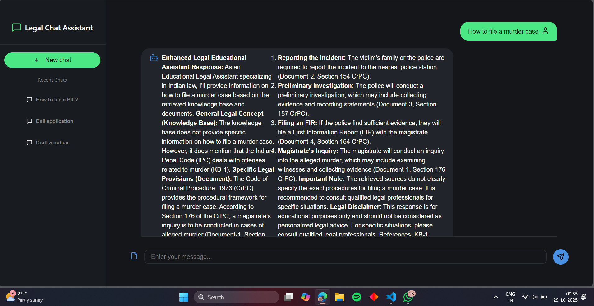

# ⚖️ Legal Chat Assistant

**Domain**: AI/ML

**Problem Statement**: 
Develop an AI-powered Legal Chatbot capable of providing guidance and insights related to the Indian Constitution and Legal Cases, using scraped data and intelligent agent routing.

---

## ⚙️ System Review

The chatbot uses Groq API to process user queries, intelligently routing them to specialized agents:
- 🏦 **Constitutional Agent** — handles queries related to the Indian Constitution (e.g., fundamental rights, articles, etc.)
- ⚖️ **Legal Court Agent** — handles queries related to court cases, inheritance, property disputes, etc.

---

## 🧩 Workflow Breakdown

### a. Tech Stack
- **Framework:** FastAPI / Flask
- **Language:** Python
- **AI Model:** Groq API (LLaMA or Mixtral models)
- **NLP Layer:** LangChain for context retrieval and prompt management

---

### b. Agent Routing System
- User sends a query (via frontend)
- Router module analyzes the intent using NLP classification
    - If query relates to constitutional law, → forward to **Constitutional Agent**
    - If query relates to legal disputes or cases, → forward to **Legal Court Agent**
- The selected agent retrieves relevant information from `legal_knowledge_base.txt`
- Context is passed to the Groq LLM endpoint for final reasoning and response generation
- Response returned in structured JSON format
---

##  Backend flow

```bash
graph TD
A[User Query] --> B[Router Module]
B -->|Classify Intent| C[Constitutional Agent]
B -->|Classify Intent| D[Legal Court Agent]
C --> E[Search legal_knowledge_base.txt]
D --> E
E --> F[Groq API (LLM Call)]
F --> G[Summarized Legal Response]
G --> H[Return JSON Response]
```

##  Frontend flow

#### Tech used:
- React.jsx
- Fetch API for backend communication

#### Flow:
- User enters a legal question in chatbot interface.

- A POST request is made to backend endpoint `/api/chat`:

- Frontend displays the chatbot’s response and source reference dynamically.



## 🚀 Getting Started

### 1. Clone repository or download zip.

### 2. Generate API key from Groq API Key dashboard

### 3. In folder ```backend``` create a ```.env``` file and add the ```GROQ_API_KEY```

### 4. Open terminal and write the following commands:
```bash 
cd backend
pip install -r requirements.txt
uvicorn app:app --reload
```
```bash 
cd frontend 
npm install
npm run dev 
```

### 5. Run [https://localhost:5173/](http://127.0.0.1:8000) and you are good to go.

